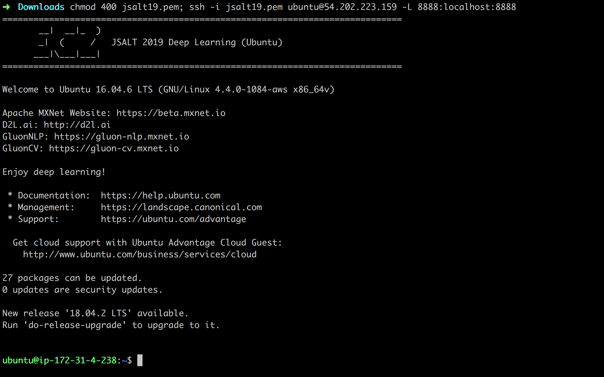
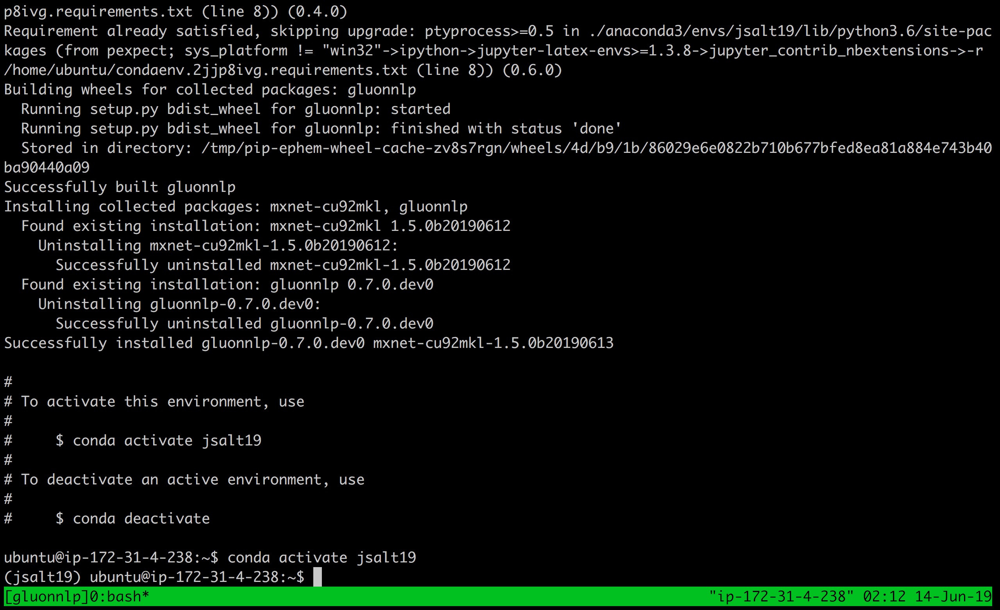
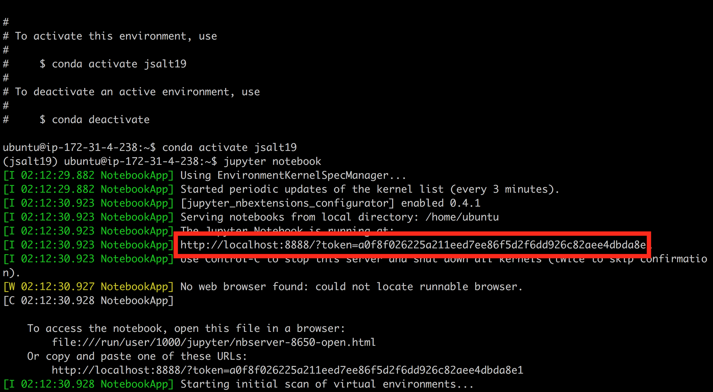

# Setup instructions

## download the key
[SECRET LINK HERE]

## grab a machine

Fill names in https://tinyurl.com/jsalt-gpu

## ssh to the machine

### mac & linux:
```
chmod 400 jsalt19.pem;
ssh -i jsalt19.pem ubuntu@your_ip -L 8888:localhost:8888
```



### windows:

http://support.moonpoint.com/os/windows/network/ssh/putty/forward-port80.php

Note that you need to update with destination port to 8888 instead of 80

### tmux/screen start session

create: tmux new -s gluonnlp
attach: tmux a -t myname

## Prepare environment

```
conda env update --prune mxnet/jsalt19
conda activate jsalt19
```


## Get JSALT 2019 materials

```
git clone https://github.com/eric-haibin-lin/JSALT19-GluonNLP
```

## Start notebook server
`jupyter notebook`

